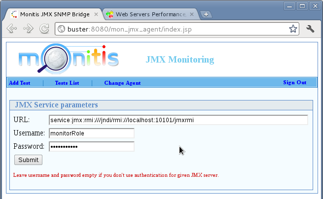

# Checking HBase Vitals

In this lab we will run a monitoring tool `Monitis` to check vital metrics of an HBase machine.

Lab Goals:

1. Installing the `Monitis` 
2. Setting proper rules to check vital parameteres

### STEP 1) Setup JMX remote access
Create these files:
```bash
$HBASE_HOME/conf/jmxremote.passwd (set permissions to 600)
monitorRole monitorpass
controlRole controlpass
```
```bash
$HBASE_HOME/conf/jmxremote.access
monitorRole readonly
controlRole readwrite
```

### STEP 2) Configure JMX in HBase startup
Edit `$HBASE_HOME/conf/hbase-env.sh` script to add JMX support
```bash
$HBASE_HOME/conf/hbase-env.sh
```
add these lines:
```bash
HBASE_JMX_OPTS="-Dcom.sun.management.jmxremote -Dcom.sun.management.jmxremote.ssl=false"
HBASE_JMX_OPTS="$HBASE_JMX_OPTS -Dcom.sun.management.jmxremote.password.file=$HBASE_HOME/conf/jmxremote.passwd"
HBASE_JMX_OPTS="$HBASE_JMX_OPTS -Dcom.sun.management.jmxremote.access.file=$HBASE_HOME/conf/jmxremote.access"

export HBASE_MASTER_OPTS="$HBASE_JMX_OPTS -Dcom.sun.management.jmxremote.port=10101"
export HBASE_REGIONSERVER_OPTS="$HBASE_JMX_OPTS -Dcom.sun.management.jmxremote.port=10102"
```

### STEP 3) Installing the Monitis JMX Agent
To download, log on to your Monitis account and select `Monitors -> Manage Monitors -> JMX` 


The JMX Monitors window will open. At the bottom of it, you will find a link to download the JMX Agent:


### STEP 4) Creating an HBase Monitor in Monitis
* Once it logs you in, the JMX Agent will prompt you to enter an Agent Name:
* Enter a unique name and click on `save` button
* Enter the credentials and click `submit`:



* Select the `hadoop` domain from the drop down menu
* Select the `HBase service -> RPC Statistics` and see the number of metrics on the next page:


* Under `Monitor Name` enter something meaningful.
* Set `Check Interval` number to 1
* Select the following attributes:
  - getNumOps
  - getAvgTime
  - getMinTime
  - getMaxTime
  - putNumOps
  - putAvgTime
  - putMinTime
  - putMaxTime


* Click on the `Add Monitor` button at the bottom 

### STEP 5) Monitoring
* We are now ready to log on to Monitis and examine the data collected by our newly created monitor. If you are just logging on, Monitis will prompt you to add the new monitor, otherwise go to `Monitors -> Manage Monitors -> JMX Monitors` to open the familiar JMX Monitors screen
* Select the check box next to the new monitor and click Add to Window to open a new monitor window:


* That’s it! As with any monitor, you can choose between multiple views and define notifications for your HBase performance metrics:

